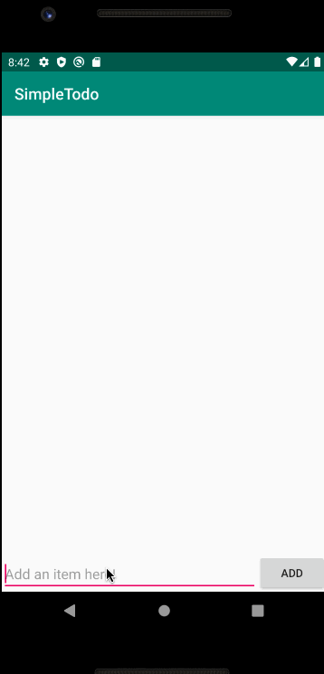

# *Todo List*

**Todo List** is an android application that allows building a todo list and basic todo items management functionality including adding new items, editing and deleting an existing item.

Submitted by: **Chase Cherico-Chipres**

## Features

The following functionality is completed:

* [x] User can **view a list of todo items**
* [x] User can **successfully add and remove items** from the todo list
* [x] User's **list of items persisted** upon modification and and retrieved properly on app restart

## Video Walkthrough

Here's a walkthrough of implemented features:

GIF created with [LiceCap](http://www.cockos.com/licecap/).
